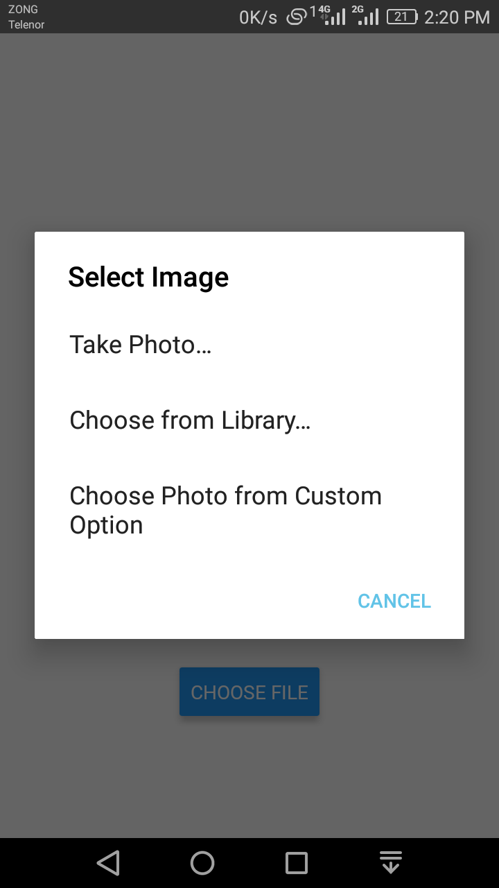

# Example of Image Picker in React Native

For picking the image we will use a very good library called react-native-image-picker. 
Which provides ImagePicker component to in which you can provide the image picking option
from Gallery or Camera.

## Installation of Dependency
To use ImagePicker we need to install react-native-image-picker dependency.
* npm install react-native-image-picker --save

## Output like this

